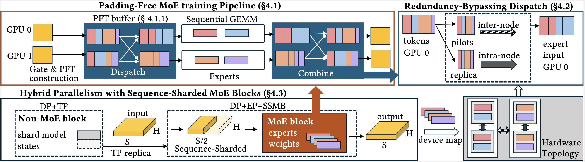
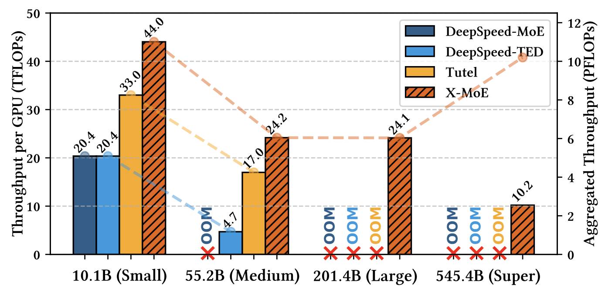

# X-MoE: Cross-Platform Training Framework for Expert-Specialized MoE

<p align="center">
  
</p>

<p align="center">
  <!-- [](https://arxiv.org/abs/2506.20686) -->
  <a href="https://supercomputing-system-ai-lab.github.io/projects/x-moe/"></a>
  
  
</p>

## 📢 News
- **2025-07-14**: X-MoE's code released
- **2025-06-26**: X-MoE has been accepted at **SC 2025** and received **Best Student Paper Nomination**

## 🚀 About
X-MoE is an **optimized cross-platform framework** for training large-scale **expert-specialized Mixture-of-Experts (MoE)** models (e.g., DeepSeek-MoE style). It introduces system-level enhancements for improved end-to-end throughput and memory efficiency. 

This project is built on top of [DeepSpeed](https://github.com/microsoft/DeepSpeed) and [Megatron-DeepSpeed](https://github.com/microsoft/Megatron-DeepSpeed).


## ✨ Features

### Key Capabilities

- **Flexible Training Modes**: Support both token-dropping and no-token-dropping training
- **Padding-Free Design**: Eliminates all zero-paddings to save communication and memory
- **Communication Optimization**: Reduce inter-node communication overhead on hierarchical networks
- **Memory Efficiency**: Hybrid TP+SP strategy to reducing activation memory
- **Cross-Platform Compatibility**: Heterogeneous GPU support


#### Padding-Free MoE Training Pipeline (PFT)
X-MoE introduces **PFT (Padding-Free Token buffers)**, which eliminates zero-padding through MoE computation and communication stages. We use **Triton-based kernels** to handle sparse and irregular workloads.


#### Redundancy-Bypassing Dispatch (RBD)
A hierarchical multi-stage dispatching process that eliminates redundant inter-node communication by using pilot tokens and local replicas, reducing communication overhead on repeated tokens. It is implemented with Torch.distributed and Triton features.


#### Sequence-Sharded MoE Blocks (SSMB)
A hybrid parallelism strategy that combines tensor-slicing with sequence-sharded execution for MoE blocks, reducing activation memory by a factor of the TP group size while maintaining compatibility with standard MoE routing.

> For DeepSeek-style MoE training, activation can easily become a bottleneck. Please check our paper for analysis and learn about the use case.


## 🏁 Quick Start

### Prerequisites
We use **Megatron-DeepSpeed** as our end-to-end training system. To use the Megatron backend, you need to install the platform-specific version of **APEX**, which may take some time. For efficient end-to-end training, we also recommend installing **Flash Attention**.

#### For NVIDIA Users
Please follow the commands below to install the corresponding versions of APEX and FlashAttention:

```bash
# Install Apex with CUDA extensions
git clone https://github.com/NVIDIA/apex && cd apex
pip install -v --disable-pip-version-check --no-cache-dir --no-build-isolation --config-settings "--build-option=--cpp_ext" --config-settings "--build-option=--cuda_ext" ./

# Install FlashAttention (Optional)
pip install flash-attn --no-build-isolation
```

#### For AMD Users
Installation on AMD platforms can be more complex, so we provide a detailed guide. We strongly recommend referring to the **Frontier (MI250X) installation guide** for step-by-step instructions.

**💡 [Frontier Installation Guide](x-moe-docs/frontier-installation-guide.md)**

*[Special] For **Frontier Supercomputer** Users*:
We have a **pre-built environment** shared on Frontier. You may refer to the installation guide above and directly use that environment.


<!-- **Install dependencies**\
To run X-MoE with Megatron-DeepSpeed framework, Apex and FlashAttention is required. You can install the dependencies by running the following scripts.
```bash
# For NVIDIA GPUs:
./scripts/install_dep_cuda.sh

# For AMD GPUs
./scripts/install_dep_rocm.sh
``` -->

<!-- We've provided detailed installation guide for both NVIDIA and AMD platforms. For NVIDIA GPUs, we recommend to directly use our provided -->

### Installing X-MoE
After installation of the prerequisites, you can now install X-MoE following the commands below:

```bash
cd ~
git clone https://github.com/Supercomputing-System-AI-Lab/X-MoE
cd X-MoE
git submodule update --init --recursive --remote

pip install -e .
cd Megatron-DeepSpeed-X-MoE && pip install -e .
```


## 🏃‍♂️ Running Training with X-MoE

### 📊 Data Preparation
Before launching your own training, you need to prepare the data to **Megatron's data format**. You may refer to the [Megatron Data Preparation Guide](https://github.com/NVIDIA/Megatron-LM?tab=readme-ov-file#data-preparation).

If you just want to **test the X-MoE training**, we also provide a script to prepare the sample dataset:
```bash
cd ~/X-MoE/Megatron-DeepSpeed-X-MoE/examples_xmoe/data
./prepare_data_ae.sh
```

### 🚀 Launch Your Training Example

We provide training examples with **two launching methods**: `torchrun` and `srun`. Below is the structure of the example scripts we provided:

```bash
examples_xmoe/
├── scripts/           # scripts using torchrun to launch; tested with NVIDIA A100 node
│   ├── X-MoE-Small-node-1.sh
│   └── ...
└── scripts-frontier/  # scripts using srun to launch; tested on Frontier (MI250X)
    ├── n8-Small-XMoE.slurm
    └── ...
```

**Quick Start Recommendation**: Use `X-MoE-Small-node-1.sh` or `n8-Small-XMoE.slurm` to launch a **10B DeepSeek-MoE-like model** training task on one GPU node with multiple GPUs.

#### Option 1: Using torchrun (NVIDIA)
```bash
cd ~/X-MoE/Megatron-DeepSpeed-X-MoE/examples_xmoe/scripts
./X-MoE-Small-node-1.sh <NUM_GPUS> <MICRO_BATCH_SIZE>
```

#### Option 2: Using srun (Frontier Supercomputer)
```bash
cd ~/X-MoE/Megatron-DeepSpeed-X-MoE/examples_xmoe/scripts-frontier
./n8-Small-XMoE.slurm
```

### ⚙️ How to Enable X-MoE Optimizations?

#### Basic Optimizations
We integrated the X-MoE optimization API into **Megatron's launching arguments**. Specify these flags to enable basic optimizations:

```bash
--use-uneven-all-to-all \
--use-pft
```

These flags enable **padding-free format training** and corresponding kernels.

#### Advanced Optimizations (Large-scale, Multi-node)

I. *Redundancy-Bypassing Dispatch*: For DeepSeek-style model training on multi-node settings, specify:
```bash
--use-rbd
```
This enables **redundancy-bypassing dispatching** and may reduce all-to-all communication time.

II. *Sequence Sharding for Memory Optimization*:
If activation memory becomes a bottleneck, specify:

```bash
--tensor-model-parallel-size <TP_SIZE>
```

When `--enable-expert-tensor-parallelism` is *not* specified, the above flag will automatically enable **sequence sharding for MoE blocks**.

---

## 📊 Evaluation

Our evaluation on the **Frontier supercomputer** demonstrates that X-MoE enables:

- Training of models up to **545B parameters** on **1024 AMD GPUs**
- **10× larger** than existing solutions  
- Up to **1.42× higher** training throughput

<p align="center">
  
</p>

## 📝 Citation

Coming soon...

