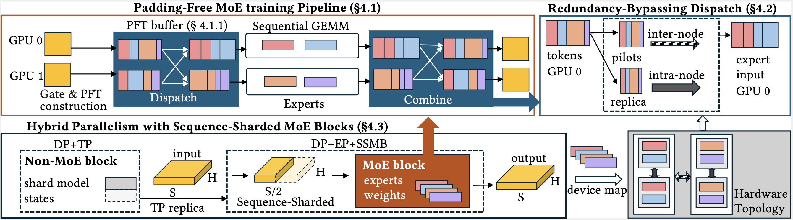
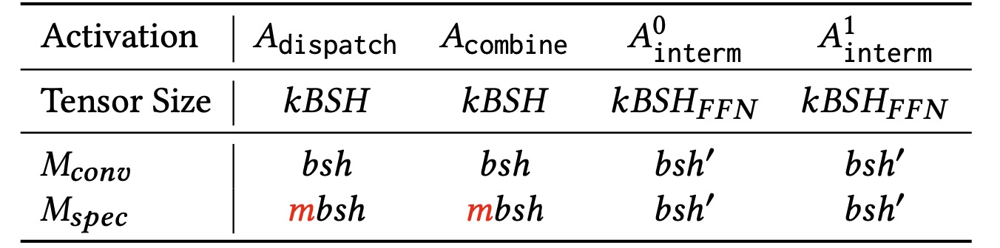
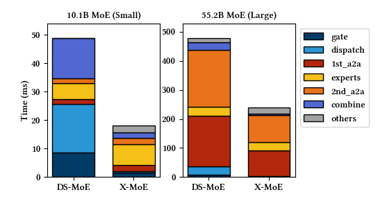
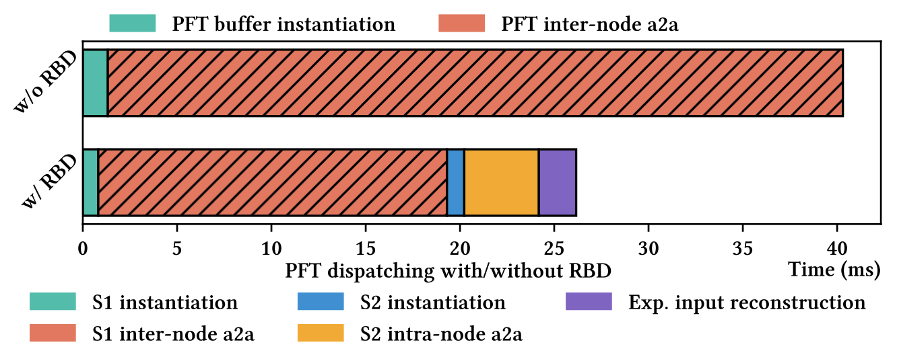
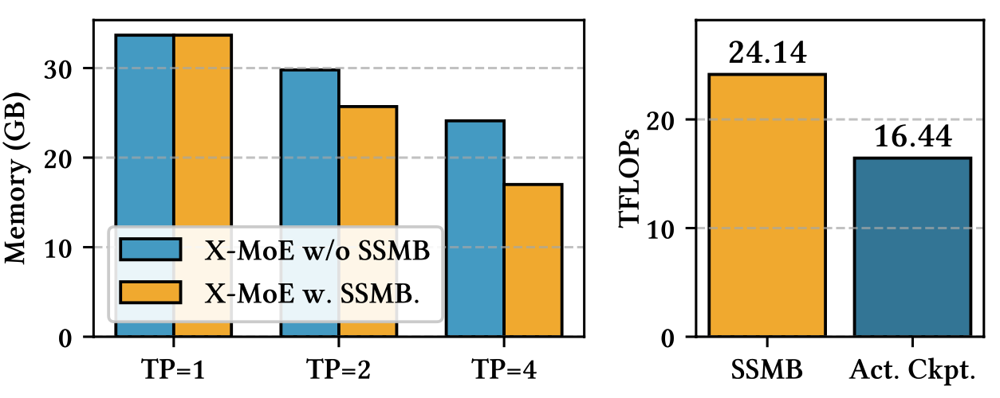
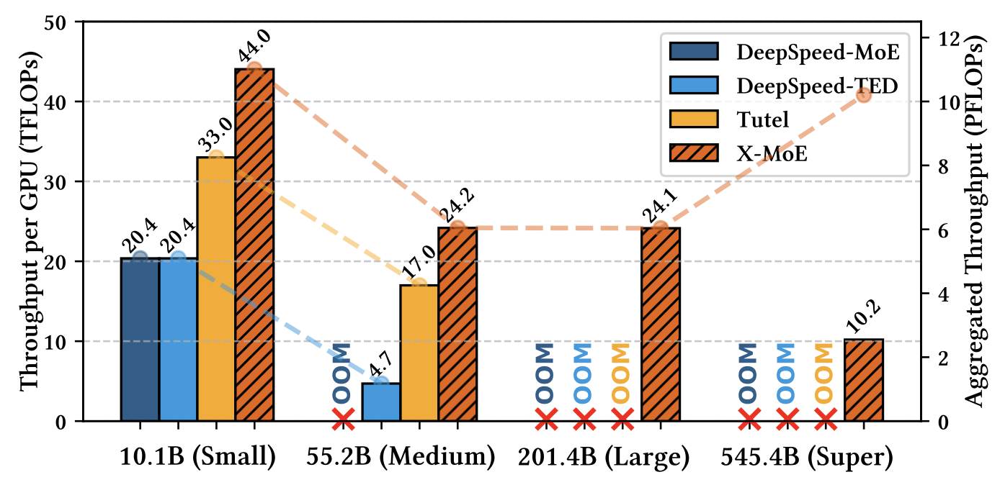

前言
# X-MoE: Scaling DeepSeek-style MoEs on Frontier—training practice, what limited and what we fixed

When we first tried to train DeepSeek-style MoEs on Frontier (AMD MI250X + Dragonfly/Slingshot), two things derailed us immediately: training ran out of memory, and even when it didn’t, it crawled. Off-the-shelf stacks that work fine on NVIDIA DGX clusters were leaving huge performance on the table on Frontier. This post is our “why” and “how” behind X-MoE, our system that makes those models trainable and fast on non-NVIDIA HPC platforms.

At a glance, X-MoE scales DeepSeek-style models to **545B parameters on 1,024 GPUs** on Frontier, lifting the ceiling by **10×** under the same hardware budget and sustaining high throughput. X-MoE's code is open-source at https://github.com/Supercomputing-System-AI-Lab/X-MoE.

  

## Expert-specialized MoEs training practice on Frontier

DeepSeek-style MoE architectures emphasize expert specialization: they use a large number of fine-grained experts and route each token to multiple experts with a high top-k (e.g., 256 experts with k=8 in DeepSeek-v3). This design improves model quality per FLOP, but it also shifts what dominates the systems cost of training.

Most existing efforts to train these expert-specialized MoEs have focused on NVIDIA GPUs. However, when we attempted to train a scientific MoE model on the AMD-based Frontier supercomputer (MI250X + Slingshot), off-the-shelf methods quickly broke down. At the start, we tried state-of-the-art frameworks, but we ran into serious issues:

 - **Out-of-memory (OOM) at moderate scale**. Using DeepSpeed-MoE to train expert-specialized MoEs with even moderate sequence lengths (e.g., 2048 or 4096) often led to OOMs—even for relatively small models (e.g., DeepSeek-MoE 16B with EP and ZeRO DP on 8 GPUs).

- **Extremely low throughput**. When we did manage to make training run by reducing model depth, we observed that both DeepSpeed-MoE and Tutel achieved <10 TFLOPs per GPU on MI250X, which is less than 10% of peak performance. We also experimented with Megablocks, but it often hung beyond a single node, and in practice also delivered very low throughput (again, <10 TFLOPs).
 
## What make it so hard to train DeepSeek-style MoE on Frontier?

#### 1) The activation memory becomes significant.
DeepSeek-style MoEs increase top-k and shrink expert FFN hidden sizes. That keeps parameters and per-token FLOPs roughly constant but moves the activation bottleneck into the dispatch and combine tensors, which now grow with the fine-grained factor m (i.e., with top-k).

To be more intuitive, the table below shows the sizes of the 4 dominative activation tensors in the MoE block, where $M_{conv}$ means conventional MoE model $M_{spec}$ means expert-specialized MoE model.

  

#### 2) Zero padding is killing memory and bandwidth.
Conventional pipelines build dense dispatch masks and **fixed-capacity expert buffers**, padding unused slots with zeros; those zeros are then carried through expert compute and both all-to-alls. On DeepSpeed-MoE, the dispatch mask and intermediates alone can account for >70% of activation memory in DeepSeek-style configs.

#### 3) Communication becomes the limiter.
Frontier’s network is hierarchical and asymmetric: Within a node, MI250X GPUs communicate over Infinity Fabric (~200 GB/s); across nodes, Slingshot links are ~25 GB/s. In our experiments, all-to-all communication (domincated by interconnection) usually take more than 50% of training time when training an expert-specialized MoE model on 64 GPUs. As a comparison, for conventional MoEs at same scale, the communication only takes ~10% time.

One issue is caused by the **token duplication**: With large k, MoE's token routing duplicates traffic. if several of a token’s experts live on the same remote node, existing systems send multiple copies of the same activation across the slow link. Existing systems treat all GPUs the same, so tokens get duplicated across inter-node links when multiple selected experts live on the same destination node. 
> Extra observations: At larger scales, Frontier’s all-to-all latency also spikes beyond 256 GPUs, with frequent outliers >500 ms, which is likely caused by cross-rack traffic. 

### Why DeepSpeed/Megablocks/DeepEP weren’t enough here

- DeepSpeed-MoE/TED & Tutel: dense, CUDA-centric pipelines that rely on padded buffers; they don’t address the activation explosion in dispatch/combine for large-k MoEs, and they run suboptimally on ROCm/RCCL. 
 

- Megablocks: elegant block-sparse primitives with no-drop training, but kernels pad to block sizes and are tightly integrated with NVIDIA Megatron-LM, limiting AMD portability. 
 

- DeepEP/TCCL: compelling EP/NCCL variants, but NVIDIA-specific (Hopper intrinsics / NCCL). We needed something that runs well on ROCm and Dragonfly/Slingshot.

## What X-MoE changes

X-MoE is an end-to-end training stack with three concrete system pieces that directly target the above failure modes:

#### 1) A truly padding-free MoE pipeline with cross-platform kernels
We introduce **PFT (Padding-Free Token) buffers**: instead of fixed [E, C, H] expert buffers and a [S, E, C] dispatch mask, PFT stores only routed tokens (with dropped ones removed) plus a compact set of ERI-arrays—`token_ids`, `expert_ids`, `tokens_per_expert`, and `combine_weights`. The MoE stages (gating → dispatch → expert MLP → combine) are rewritten to run on PFT, with the all-to-alls now uneven and free of zero padding. The implementation of PFT is based on Megablocks' code. We thank Megablock team for their open-source efforts.

To make this fast across vendors, we implement **Triton gather/scatter kernels** that coalesce irregular PFT accesses and a sequential-GEMM path that launches one GEMM per local expert on uneven token batches.

**What this buys us.** Isolating PFT (disabling other tricks) on 256 GPUs:

- On a 10.1B “Small” MoE, we accelerate gating 5.7×, buffer dispatch 35.7×, buffer combine 8.1×; net MoE-layer time −62.3%, comparing to DeepSpeed-MoE.
- Per-layer activation memory drops to 1.21 GB vs 2.81 GB (DeepSpeed-MoE) and 1.95 GB (Tutel).

  

^ Comparison of X-MoE and DeepSpeed-MoE, with only PFT optimization enabled

#### 2) **Redundancy-Bypassing Dispatch (RBD)**
We restructure dispatch into two stages that respect Frontier’s hierarchy. We send only **pilot tokens** across nodes, one representative for each “(source node, destination node)” group, and materialize **local replicas** for same-node duplicate experts using fast intra-node links. This bypasses redundant inter-node copies while preserving correctness.

In the unit test, RBD reduces inter-node all-to-all time by **52.5%** at a EP=32 configuration, yielding an overall **1.55× dispatch speedup**.

  

#### 3) **Hybrid parallelism with Sequence-Sharded MoE Blocks (SSMB)**
Tensor-parallel (TP) replicas duplicate activations; DeepSeek-style MoEs make the dispatch/combine tensors the dominant cost. **SSMB partitions the sequence across TP ranks _only within MoE blocks_**, executes gating→dispatch→experts→combine on those slices, and all-gathers afterwards to re-enter dense blocks. This reduces dispatch/combine footprints by the TP group size while staying compatible with standard routing and collectives.

SSMB lowers peak memory increasingly as TP grows, and—unlike activation checkpointing—avoids recompute and extra backward all-to-alls; at similar memory, SSMB achieves **24.1 TFLOPS vs. 16.4 TFLOPS** with checkpointing.

  

^ Left: memory saving; Right: SSMB vs. activation checkpointing

## End-to-end results on Frontier
X-MoE delivers better training efficiency that SOTA frameworks on Frontier: On 256 GPUs, DeepSpeed-MoE/TED/Tutel OOM on 201B-parameter “Large”, while X-MoE trains it; on 55.2B “Medium”, X-MoE is 5.15× faster than DeepSpeed-TED and 1.42× faster than Tutel. 

  

## Repro details

We used PyTorch 2.2.0, ROCm 5.7.1, DeepSpeed 0.15.5, RCCL + AWS-OFI-RCCL (libfabric 1.20.1), and standard env tuning for Frontier. MI250X peak is ~191.5 TFLOPS per GCD (effective GPU). 
